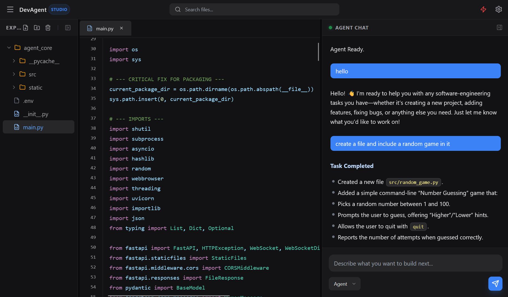

# 🤖 OpenDev Studio
### Your Local-First Agentic Software Engineering system

**OpenDev Studio** is a powerful, local-first agentic workspace that lives in your terminal. It connects a modern React web interface to your local file system, allowing an autonomous AI agent to write code, create files, and architect software alongside you.



---

## ✨ Features

* **Local Filesystem Access:** The agent reads and writes directly to your current working directory. No copy-pasting required.
* **Modern Web UI:** A clean React + Tailwind interface served locally.
* **Agentic Capabilities:** Powered by LangGraph and Large Language Models (Groq/OpenAI) to handle complex engineering tasks.
* **Live Synchronization:** Changes made in the UI reflect instantly in VS Code (and vice versa).
* **Security:** Your code stays local. The server runs on `localhost`.

---

## 🚀 Installation

Requires Python 3.9 or higher.

```bash
pip install opendev-studio
```

---

## 🛠️ Quick Start

### 1. Create a Project Folder

Navigate to the folder where you want the agent to work.

Or create a new one like this :

```bash
mkdir my-new-app
cd my-new-app
```

### 2. Configure API Keys (Crucial!)

DevAgent Studio requires API keys to power its AI brain. Create a file named `.env` in your project folder and add your keys:

**File: `.env`**

```env
# Required for the main reasoning agent
GROQ_API_KEY=gsk_your_groq_key_here

# Optional (depending on your configuration)
OPENAI_API_KEY=sk_your_openai_key_here
```

**Where to get API keys:**
- **Groq API Key:** Sign up at [console.groq.com](https://console.groq.com)
- **OpenAI API Key:** Sign up at [platform.openai.com](https://platform.openai.com)

### 3. Start the Studio

Run the following command in your terminal:

```bash
start-opendev
```

The interface will automatically open in your browser at `http://127.0.0.1:8000`.

---

## ❓ Troubleshooting

### "Command not found" or "is not recognized"

On Windows, if you see an error saying `start-opendev` is not recognized, it means your Python Scripts folder is not in your system PATH.

**The Fix:** You can run the tool directly using Python without changing system settings:

```bash
python -m agent_core.main
```

**Alternative (Add to PATH permanently):**

1. Find your Python Scripts directory (usually `C:\Users\YourName\AppData\Local\Programs\Python\Python3X\Scripts`)
2. Add it to your system PATH:
   - Search "Environment Variables" in Windows
   - Edit "Path" under System Variables
   - Add the Scripts folder path
   - Restart your terminal

### Agent fails to load / "API Keys Missing"

If the UI loads but the agent says "Agent logic not found":

1. Ensure you created the `.env` file in the same folder where you ran the command.
2. Verify your API keys are correctly formatted (no extra spaces or quotes).
3. Restart the tool so it can reload the environment variables.

### Port 8000 already in use

If you see an error about port 8000 being occupied:

```bash
# Kill the process using port 8000 (Windows)
netstat -ano | findstr :8000
taskkill /PID <PID_NUMBER> /F

# Kill the process using port 8000 (Mac/Linux)
lsof -ti:8000 | xargs kill -9
```

Or specify a different port:

```bash
start-opendev --port 8080
```

---

## 🏗️ Architecture

* **Frontend:** React, TailwindCSS, Vite (Built and served statically)
* **Backend:** Python FastAPI (Handles WebSockets, File I/O, and Agent logic)
* **AI Logic:** LangChain / LangGraph
* **Communication:** WebSocket for real-time agent-to-UI updates

---

## 📖 Usage Examples

### Creating a New Web App

```
You: "Create a simple todo app with HTML, CSS, and JavaScript"
```

The agent will:
1. Analyze the requirements
2. Create necessary files (`index.html`, `styles.css`, `app.js`)
3. Write clean, functional code
4. Explain what it built

### Debugging Existing Code

```
You: "There's a bug in my authentication.py file. Fix the login function."
```

The agent will:
1. Read your existing file
2. Identify the issue
3. Propose a fix
4. Update the file

---

## 🔒 Security & Privacy

- **All data stays local:** DevAgent Studio runs entirely on your machine
- **No cloud storage:** Files are read/written directly to your filesystem
- **API keys:** Only sent to the respective AI providers (Groq/OpenAI) for inference
- **Open source:** Audit the code yourself at [github.com/yourrepo/devagent-studio](https://github.com)

---

## 🤝 Contributing

We welcome contributions! Here's how to get started:

1. Fork the repository
2. Create a feature branch (`git checkout -b feature/amazing-feature`)
3. Commit your changes (`git commit -m 'Add amazing feature'`)
4. Push to the branch (`git push origin feature/amazing-feature`)
5. Open a Pull Request

---

## 📋 Requirements

- Python 3.9+
- Node.js 16+ (for frontend development)
- API key from Groq or OpenAI
- Modern web browser (Chrome, Firefox, Safari, Edge)

---

## 🗺️ Roadmap

- [ ] Multi-agent collaboration
- [ ] Git integration
- [ ] Docker container support
- [ ] VS Code extension
- [ ] Cloud sync (optional)
- [ ] Team collaboration features

---

## 📝 License

MIT License - see [LICENSE](LICENSE) file for details

---

## 🙏 Acknowledgments

Built with:
- [LangChain](https://github.com/langchain-ai/langchain)
- [LangGraph](https://github.com/langchain-ai/langgraph)
- [FastAPI](https://fastapi.tiangolo.com/)
- [React](https://react.dev/)
- [Tailwind CSS](https://tailwindcss.com/)

---

## 📞 Support

- **Issues:** [GitHub Issues](https://github.com/yourrepo/devagent-studio/issues)
- **Discussions:** [GitHub Discussions](https://github.com/yourrepo/devagent-studio/discussions)
- **Email:** support@devagent.dev

---

**Made with ❤️ by developers, for developers**
